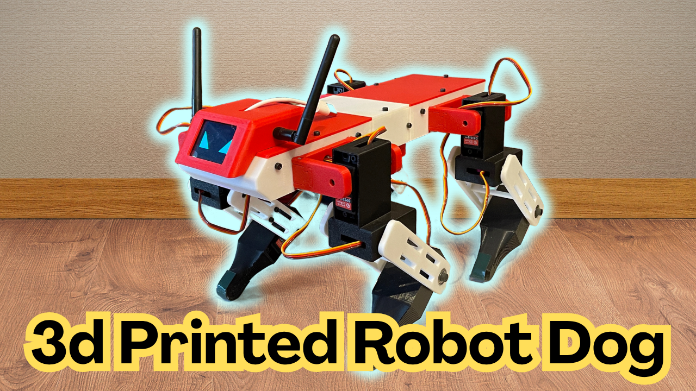

# Quattro ZBD – ESP32 Quadruped Firmware

Firmware for a 4-legged, 12 DOF quadruped robot dog running on an ESP32.

**Features**

- Trot (default) and walk gaits, switchable at runtime
- IMU body leveling (Kalman-filtered) with automatic IMU calibration
- Control from an Android app over Wi-Fi (UDP) and/or a Bluetooth gamepad
- On-board TFT screen with telemetry and a settings menu (settings saved in flash)
- 9 emotes (see [Emotes](#emotes))
- Dual-core FreeRTOS design: kinematics at 120 Hz on Core 1, screen/menu/UDP on Core 0

---

## Hardware

| Part | Notes |
|---|---|
| ESP32 dev board (ESP32-WROOM, classic ESP32) | Bluetooth gamepad support needs the original ESP32 |
| PCA9685 16-channel servo driver | I²C address `0x40` |
| 12 × DS3218 servos | 3 per leg |
| MPU6050-class IMU | I²C address `0x68`.
| 2" ST7789 TFT, 240×320 (SPI)
| Voltage divider on battery | Read on GPIO 32 |
| 3S battery + buck converters

> **Power warning:** never power the servos from USB or from the ESP32 board. Use buck converters sized for servo stall current, with a common ground. Don't run USB and battery servo power at the same time while testing unless the grounds and logic supply are set up for it.

### Pin map

| Function | ESP32 pin |
|---|---|
| I²C SDA (PCA9685 + IMU) | GPIO 21 |
| I²C SCL (PCA9685 + IMU) | GPIO 22 |
| Battery voltage sense | GPIO 32 |
| TFT | see [TFT_eSPI setup](#tft_espi-setup) |

### Servo channel map (PCA9685)

Logical servo ID → channel is `group = id / 3; channel = group * 4 + id % 3`.

| Leg | Channels |
|---|---|
| FR (front right) | 0, 1, 2 |
| FL (front left) | 4, 5, 6 |
| RR (rear right) | 8, 9, 10 |
| RL (rear left) | 12, 13, 14 |

Channels 3, 7, 11 and 15 are unused.

---

## Software setup

### 1. Arduino IDE

Arduino IDE 2.x with the **ESP32 board package by Espressif** (or the Bluepad32 package, see below).

Recommended Tools settings:

| Setting | Value |
|---|---|
| Board | ESP32 Dev Module |
| Upload speed | 921600 (drop to 115200 if uploads fail) |
| CPU frequency | 240 MHz |
| Partition scheme | Default (or **Huge APP** if using Bluepad32) |
| Serial monitor baud | 115200 |

### 2. Libraries (Library Manager)

| Library | Author |
|---|---|
| Adafruit PWM Servo Driver Library | Adafruit |
| Adafruit MPU6050 | Adafruit |
| Adafruit Unified Sensor | Adafruit |
| Adafruit BusIO | Adafruit (installed automatically as a dependency) |
| TFT_eSPI | Bodmer |

Built in with the ESP32 core (nothing to install): `Wire`, `WiFi`, `WiFiUdp`, `SPI`, `Preferences`.

**Optional, for the Bluetooth gamepad:** **Bluepad32**. It is not in the Library Manager; it ships as its own board package (`esp32_bluepad32`). Without it the firmware still compiles and runs app-only. Setup steps are in [Optional: Bluetooth gamepad (Bluepad32)](#3-optional-bluetooth-gamepad-bluepad32) below.

### TFT_eSPI setup

TFT_eSPI is configured in the **library's** own `User_Setup.h` (in `Arduino/libraries/TFT_eSPI/`), not in this sketch. Edit it to match your screen and wiring, for example:

```cpp
#define ST7789_DRIVER
#define TFT_WIDTH  240
#define TFT_HEIGHT 320

#define TFT_MOSI 23
#define TFT_SCLK 18
#define TFT_CS   15
#define TFT_DC    2
#define TFT_RST   4
#define TFT_BL    5     // backlight, if wired
```

These are the pins used on my build. Adjust them to your wiring and, if the colors look inverted or the image is mirrored/rotated, try `TFT_INVERSION_ON` / `TFT_INVERSION_OFF` or the `TFT_RGB_ORDER` setting. An upgrade of the TFT_eSPI library overwrites `User_Setup.h`, so keep a copy.

### 3. Bluetooth gamepad (Bluepad32)

The gamepad is optional. With the normal ESP32 board package the Bluetooth code compiles to no-ops and the robot runs app-only.

To enable it:

1. **File → Preferences → Additional boards manager URLs**, add:
   `https://raw.githubusercontent.com/ricardoquesada/esp32-arduino-lib-builder/master/bluepad32_files/package_esp32_bluepad32_index.json`
2. **Boards Manager**: install **esp32_bluepad32**.
3. **Tools → Board → "ESP32 + Bluepad32 Arduino" → ESP32 Dev Module**.
4. **Tools → Partition Scheme → "Huge APP (3MB No OTA/1MB SPIFFS)"**.

Pairing: put the gamepad in Bluetooth pairing mode while the robot is powered. After the first pairing it reconnects automatically. Bluepad32 on the classic ESP32 supports both Bluetooth Classic and BLE pads. See the settings at the top of `Robot_Bluetooth.h` (`ENABLE_BT_CONTROLLER`, axis sign flips, pairing wipe).

### 4. Flash

1. Put all files from the `Quadruped_Firmware` folder into one sketch folder (the folder name must match the `.ino` name).
2. Open `Quadruped_Firmware.ino`, select the board and port, and upload.
3. Open the Serial Monitor at 115200 baud to see boot, IMU and Bluetooth messages.

---

## Connecting the app

The ESP32 starts its own Wi-Fi access point:

| Setting | Value |
|---|---|
| SSID | `QUADRUPED_ESP32` |
| Password | `12345678` |
| UDP port | `5000` |

Join that network from your phone, then open the Android control app. **Change the password** in `Quadruped_Firmwarev1.ino` (`AP_PASSWORD`) before using the robot anywhere other than your workshop, and keep the app in sync.

The app sends control packets and receives telemetry over UDP. The emote list in the app must match the firmware `EMOTES[]` order, because the app sends the emote *index*.

---

## Controls

Same logic for the app and the gamepad.

| Input | Action |
|---|---|
| Left stick | Walk (forward/back, strafe) |
| Right stick X | Turn on the spot |
| L1 / R1 | Body height down / up (hold both 2 s = stand / sit) |
| L2 / R2 | Pitch trim nose down / up |
| A | Body leveling (balance) on/off |
| B | Gait toggle: **trot ↔ walk** |
| Y | Emote mode on/off |
| X | Play / stop selected emote |
| D-pad left/right | Choose emote (in emote mode) |
| R3 | Re-run IMU auto-calibration (standing only) |
| SELECT / BACK | **Emergency stop** while held |

While sitting, the same buttons navigate the on-screen settings menu (L1/R1 up/down, L2/R2 left/right, A enter/save, B back/cancel). Entering emote or puppet mode resets the gait to trot.

---

## Tunables

Main constants are at the top of `Quadruped_Firmwarev1.ino`. The ones you're most likely to touch:

| Constant | Default | Meaning |
|---|---|---|
| `STEP_HEIGHT` | menu-adjustable | Foot lift in trot |
| `WALK_STEP_HEIGHT` | `0.010f` (1 cm) | Foot lift in walk gait |
| `LEVEL_GAIN_DEFAULT` | `0.6f` | Body-leveling strength |
| `CAL_ZERO_DURATION_S` / `CAL_BOW_DURATION_S` / `CAL_HOLD_DURATION_S` / `CAL_RETURN_DURATION_S` | `1.0 / 0.8 / 0.5 / 1.0` | Timing of the IMU auto-calibration "bow" routine |
| `CAL_TILT_MAGNITUDE_M` | `0.025f` | Tilt amount used during calibration |
| `AP_SSID`, `AP_PASSWORD`, `UDP_PORT` | see above | Wi-Fi settings |

---

## First boot checklist

1. **Take the load off the feet.** Put the robot on a stand so the legs hang free.
2. Power the servo rail from the battery/bucks, then the ESP32. Confirm all 12 servos respond and each leg moves in the correct direction. Fix mounting or direction constants before letting it stand.
3. Check the serial log for the PCA9685 and IMU detection messages.
4. Place the robot flat on the ground and let the IMU auto-calibration finish (it also re-runs with R3).
5. Stand it up, enable balance with A, and test walking at low speed.

---

## Emotes

9 emotes: Curious Head Tilt, Cautious Object Tap, The Wiggle, Play Bow, Happy Dance into Sneak, Breathing into Foot Stomp, Matrix Gyro Roll, Push-Ups, Sit & Wave Hello.

Emote mode runs with balance disabled.

---

## Repository layout

| File | Purpose |
|---|---|
| `Quadruped_Firmwarev1.ino` | Main sketch: settings, setup, RTOS tasks |
| `Robot_Gait_Mechanism.h` | Gait engine, IMU/Kalman filter, balance, servo output |
| `Robot_Emotes.h` | Emote animations |
| `Screen_Settings.h` | TFT telemetry screen, settings menu, UDP telemetry |
| `Robot_Bluetooth.h` | Bluepad32 gamepad input |


---

## Troubleshooting

| Symptom | Check |
|---|---|
| Won't compile: `TFT_eSPI.h` setup errors | Edit `User_Setup.h` in the TFT_eSPI library folder |
| Won't compile with Bluepad32 / sketch too large | Use the *Huge APP* partition scheme |
| Blank/white screen | TFT pins, driver (`ST7789_DRIVER`), backlight pin |
| Servos twitch or the ESP32 resets | Servo supply undersized; add bulk capacitance; check common ground |
| IMU not found | I²C wiring (SDA 21 / SCL 22), address `0x68`; run the IMU test sketches |
| Robot leans while standing | Re-run IMU calibration (R3) on a flat surface |
| App can't connect | Phone must be joined to `QUADRUPED_ESP32`; disable "auto-switch to mobile data" |
| Gamepad won't pair | Bluepad32 board package selected? Put pad in pairing mode; see serial `[BT]` messages |

---

## Safety

Servos can pinch fingers and the robot can fall. Keep the emergency stop (SELECT/BACK) within reach, test on a stand first, and use a properly fused battery.

## License

Licensed under **Creative Commons Attribution–NonCommercial 4.0 International (CC BY-NC 4.0)**.

You are free to remix, adapt and build upon this design for non-commercial purposes, with appropriate credit. Commercial use of any kind is not permitted.

https://creativecommons.org/licenses/by-nc/4.0/
